# Milestone-project-3-My-Film-Review

## Contents

 ## Project Aims
 

 
click to expand

 * ### [1.who is this for and why they need a website](#who-is-this-for-and-why-they-need-a-website)
 * ### [2.project aim](##-PROJECT-AIM)
 * ### [3.website needs](#website-needs)
 * ### [4.website design needs](#website-design-needs)
 * ### [5.user needs](#user-needs)
 

 ## Design Choices
 

 
click to expand

 * ### [6.Action Plan](#action-plan)
 * ### [7.wedsite design choices](#website-design-choices)
 * ### [8.website navigation](#website-navigation)
 * ### [9.website main body](#website-main-body)
 * ### [10.website colours](#website-colours)
 * ### [11.font family](#font-family)
 * ### [12.wireframes, sketched layout](#wireframes,-sketched-layout)
 

 ## Website Build
 

 
click to expand

  * ### [13.design changes](#design-changes)
  * ### [14.code structure](#code-structure)
  * ### [15.code bugs/fixes](#code-bugs/fixes)
   

 ## Final Website
 

 
click to expand

  * ### [16.final product](#final-product)
  * ### [17.references](#References/-Credits)
   

 ## Evaluations
 

 
click to expand

 * ### [18.Deployment](#deployment)
 * ### [19.Test Website](#test-website)
 * ### [20.Project Objectives test](#project-objectives-test)
 * ### [21.Website Build Test](#website-build-test)
 * ### [22.Overall Test Conclusion](#overall-test-conclusion)
 * ### [23.Future changes/ add ons](#future-changes/-add-ons)
  

## The Strategy
## WHO IS THIS FOR AND WHY THEY NEED A WEBSITE

This is for film lovers and movie goers who want either want to know what other people thought about a particular film, or share their own thoughts on films they have seen.

## PROJECT AIM 

The aim of the project is to build a film review website, which utilizes a database to store data to be displayed on the webpage.

## User Stories

1. As a film buff I want a to see what an everyday person thinks about a movie not just professional critics or journalists. I like to build my excitement for a film I have not yet seen by seeeing what others who have already seen it think. I love to compare my own thoughts and views on a film experience with others to see if they had same experience as me or not and why.
2. I also would love a platform for me to share my own thoughts on films, so others can read my opinon on certain films and how my experience was.
3. I would want the ability to disscuss any film, popular or not, and not to be limited to only select films.

## WEBSITE NEEDS (business needs)

- To explain what the website is about and how it works to the user

- To display film data to the user

- Give the user the ability to upload their own films

-  Give the user the ability to upload their own reviews of films

- Display updated films and reviews to all users

- Secure access for users so not anyone can muniplate website content.

## WEBSITE DESIGN NEEDS

- Website needs to fun and friendly

- simple and quick to navigate

- Simple and easy to use

- Explain how the website works effectively

- website will be built with HTML, CSS, JavaScript, Python

- website database willl be mongoDB

## USER NEEDS 

- How to navigate the website

- To search for specific films 

- Ability to add new films to the site

- Ability to edit films on the site

- Ability to write reviews for films on the site

- Ability to delete reviews for films on the site

## [Back to top](#contents)

## WEBSITE DESIGN CHOICES

### Website Navigation

- To help visitors move between the pages I'm going to input a navbar. This will sit in the header of main body of the page. 
To keep the website simple and easy to use I'm going to have the same header on all pages of the site. This will help visitors intuitively understand how to move around the website.

- The navbar will display different options to the user depending on whether the user is log in or not.

### Website Footer

- This will display social media links for the webpage. This will be displayed at the bottom of all pages.

### Background Image

- The background image is being loaded straight from url source. The image is used as the background throughout the website.

### colours 

- I have choosen to use a combination of 6 basic colours for the website, the first 3 being the main colours of the website and the last three as colours for buttons. The six colours are:

- indigo 
- black
- white
- red
- green 
- light blue

- Because of my choice to use multi-coloured text, the main page background is going to be left white.

### Font Family 

- The font choosen for the website is Fredoka with cursive backup from google fonts :https://fonts.google.com/specimen/Fredoka+One?query=Fredoka+One+

- The font was choosen as it is stylish but still clear and easily readable. To keep the flow and look of the website simple but stylish the same font is used throughout the site.
 

## WIREFRAMES, SKETCHED LAYOUT

- basic page layout -

### [Back to top](#contents)

 

## DESIGN CHANGES 

Creating the website the wireframe sketched layout was used as a guide to the overall look of the website.
- url(https://rwrant.co.za/wp-content/uploads/2013/11/Movie-Montage.jpg)

### Site Navigation

- The navbar was made using materialize 

- The navbar now runs across the whole screen for better aestthetics.

### [Back to top](#contents)

 

## CODE STRUCTURE

Folders 

images -------------- contains all images used in README.md

templates -----------contains .html templates(base, home, films, register, login, profile, reviews, edit_film,
                                               add_film, add_review, )

static -------------contains 2 folders - css contains  style.css -----all CSS styling for website
                                         js contains   script.js ------ all the Javascript code for the website

app.py ------------- all python, pymongo, flask code to run website
             
design-images -------- contains all images used in README.md

### CSS
 - font family for website
 - header
 - navbar 
 - footer
 - register page
 - add film
 - film list
 - login/out text
 - Home page
 
 ### JavaScript

 - document loaded

 ### Python

 - get films
 - search
 - register
 - films.html
 - login
 - Profile
 - logout
 - add_film
 - edit_film
 - delete_film
 - reviews
 - add_reviews
 - delete_reviews
 

## CODE BUGS/FIXES

- Struggled to get reviews to load onto review page, could not get revies from database
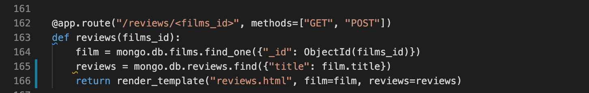

- Found soulution was using dot notation incorrectly. 
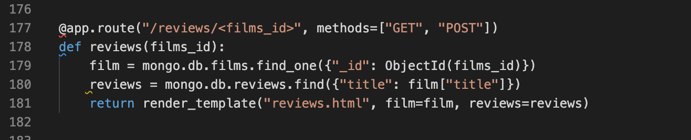

- Delete function not working correctly. Delete film function was not deleting film, website responded correctly but database was not being updated.

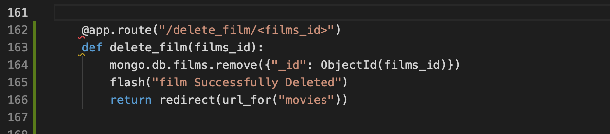

- Issue resolved. Incorrect indentation on app.py file.

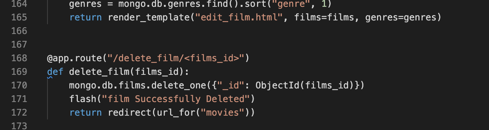

#### Issues not fixed

- media queries/ screen sizes not set.

## FINAL PRODUCT

### Main page 

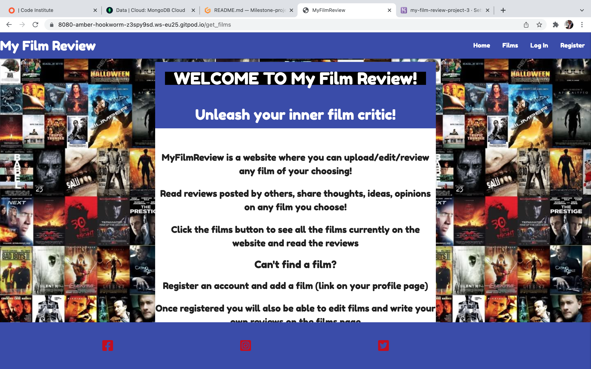

### Film page

### login Page

- This exactly same as register page except page title

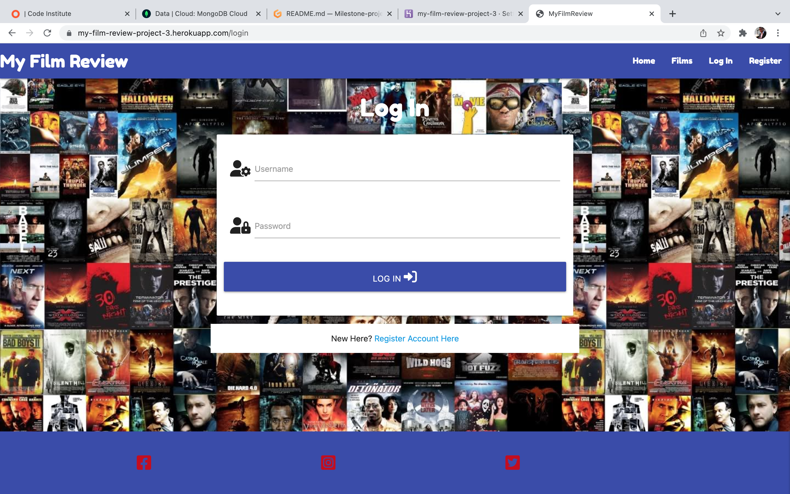

### Review page

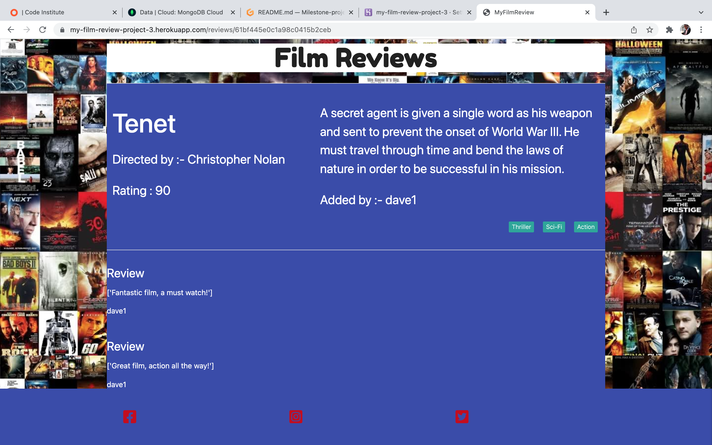

## References/ Credits 

#### Materialize

In building the website I used materialize I used this for

 
click to expand

* https://materializecss.com/
* Page layout for gallery.html and about.html
*  Creating the Navbar, https://materializecss.com/navbar.html
* 
*  collapsing navbar which needed materialize javascript code

  

#### Font Family
- The font 'Fredoka' was obtained from google fonts - https://fonts.google.com/specimen/Fredoka+One?query=Fredoka+One+

#### Markdowncollapsible section
- I got the code for the markdown collapsible section from -
https://gist.github.com/pierrejoubert73/902cc94d79424356a8d20be2b382e1ab

### [Back to top](#contents)

## Evaluation

### Deployment

My website is deployed on heroku -  https://my-film-review-project-3.herokuapp.com/

How I deployed -

1. Signed in on Heroku.com and created a new app called my-film-review-project-3
2. I then connected my github repository Chayno1/Milestone-project-3-my-film-review in the deploy method of the app 
3. I edited the apps config vars so they had the correct details and matched my projects details.
4. In deploy section clicked on automatic deploy and launched website.
5. opened live url to check website
6. Rechecked live url and proceeded to test website.

## Evaluation 

### Test Website

- To evaluate and test my project I broke the testing down into three categories;
- Project objective test
- Website Build test
- Website function test

#### Project objective test

- This part of the test is about testing the websites ability to meet the aims intially set out for the project. This includes
  website business needs, design needs, user needs and project aim.

##### Website business needs

 - To explain what the website is about and how it works to the user

- To display film data to the user

- Give the user the ability to upload their own films

-  Give the user the ability to upload their own reviews of films

- Display updated films and reviews to all users

- Secure access for users so not anyone can muniplate website content.

Evaluation : The website covers all points on business needs, 
- The main page is clear in presenting what the website is about and how to use it
- The main data for films is clearly presented and easy to use for the user
- The edit, add, delete options are displayed and easy access for logged in users only.
- Film data and reviews are accessible for everyone who visits the site.
- Only registered users can edit,add or delete films and reviews on the website.

Conclusion : The website achieves the busines needs to a basic level

##### Website design needs

- Website needs to fun and friendly

- simple and quick to navigate

- Simple and easy to use

- Explain how the website works effectively

- website will be built with HTML, CSS, JavaScript, Python

- website database willl be mongoDB

Evaluation : The website covers all 4 points on design needs,
- website gives the users plenty of editing option to keep it engaging.
- website look is simple and straight forward, intuitive to use, easy for user to navigate.
- The site is intuitive in nature and also there are clear guidance on the home page.
- the website was built with HTML,CSS and JavaScript, Python
- The database being used is mongoDB

Conclusion: The website achieves the goals of design needs to a basic level, However the styling could be better

####  website user needs 

- How to navigate the website

- To search for specific films 

- Ability to add new films to the site

- Ability to edit films on the site

- Ability to write reviews for films on the site

- Ability to delete reviews for films on the site

Evaluation : The website gives the user the desired experience asked they would want.
- Instructions on how the site works
- The ability to look up films and read other peoples reviews
- The ability to add films to the website for others to review
- Add their own reviews to films on the website
- The ability to edit or delete films on the website
- The ability to remove reviews on the website

Conclusion: All the goals are achieved to a basic level.  

####  project aim

Conclusion: Website works as expected. All functions work as expected, The database is edited correctly by the user from the webpage.

### [Back to top](#contents)

#### Website Build Test

  - This part of the test is about testing the websites links, coding and background structure. This includes testing html coding, css styling, css layout, file layout and organisation.

  #### website links, responsive design,deployment
 
 Evaluation : After deploying the website I first checked that each page loaded properly which was successful. I then tested the responsive design by changeing the screen size and observing how the website reacted, in which the website changed as designed apart from minor issue later noticed with the title, still tobe resolved.
 Next I checked all the links, the navbar links to all the pages, the footer links, social media links and main body links. I made sure that all links on all pages worked correctly and went to the correct location, also whether they opened in a new tab or changed the page as set in the coding. The website passed all these tests.

Conclusion : The frontend of the website is operating and presenting correctly as designed in the coding, no issues with overall interaction.

#### html, css

html : To test my html coding first I went through each page checking for any obvious mistakes I could notice myself. I then put my code through a coder validator at https://validator.w3.org/ , This did pick up one error, however this doesn't seem to relate properly to code on the page and as it does not effect the operation of the website no further action has been taken. results displayed below :

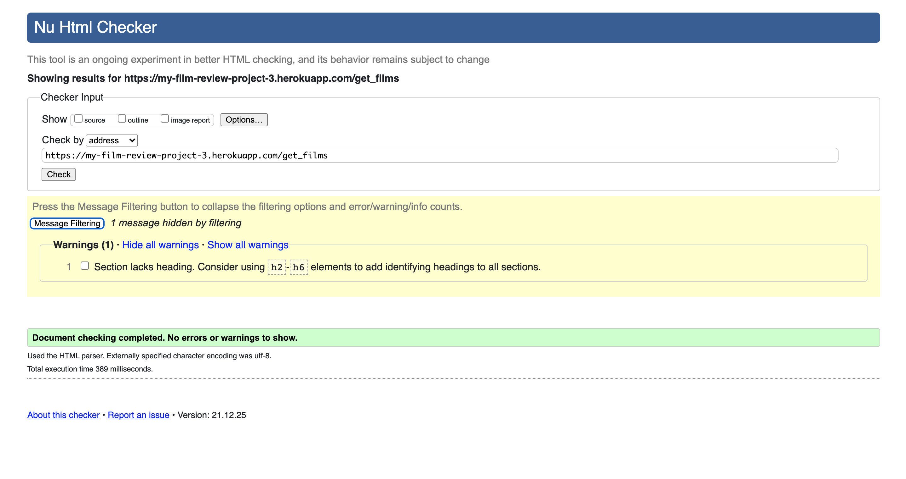

 

CSS : To test my css code I again went through my style.css sheet and visually looked for any obvious errors I noticed. I then put my code through an online css validator at https://jigsaw.w3.org/css-validator/ . This did flag up 6 errors all of which are connected to font awesome coding and 1 error with in the materialize coding. These errors do not affect the operation of the website. As my course is not yet complete I'm unable to act at this time till I learn more about different codes and how to edit hidden third party coding. Results displayed below:

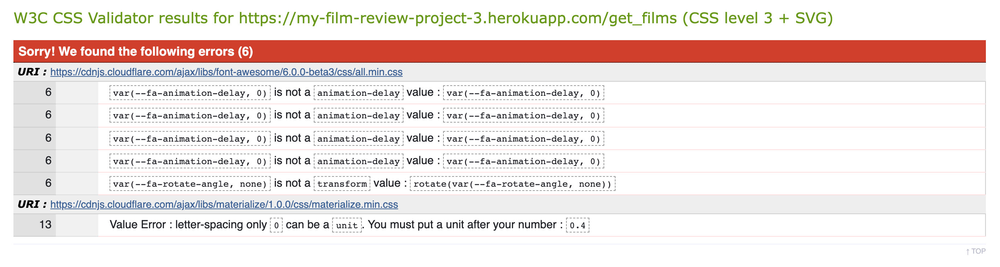
 
 lighthouse: An additional test I performed was with lighthouse in google chrome developers tools. I ran this test to get an overall read out of how my website was performing, results below :

 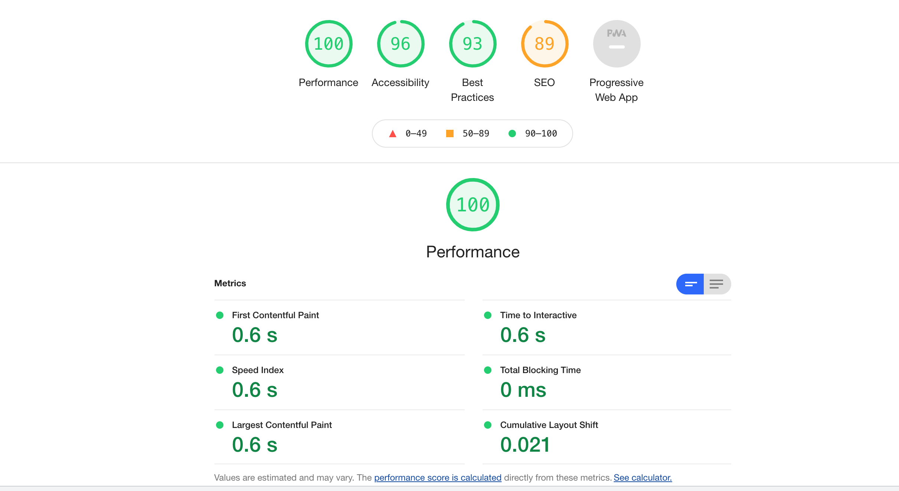

 #### Website Function Test

 - To test the function of the website I played around with the website in different ways. I viewd it from a casual browsers perspective looking at the different pages availiable and what i could do. I then signed in as a registered user and tested all the possible options and functions I have as a registered user, making sure my actions completed properly like editing a film, deleting a film, adding a review and deleteing a review.

 - To test the JavaScript I put the JavaScript code through a JavaScript checker JSHint.com. Only two warnings otherwise the javascript passed. The two warnings not fuly understood and look possibly in reference to materialize coding.

 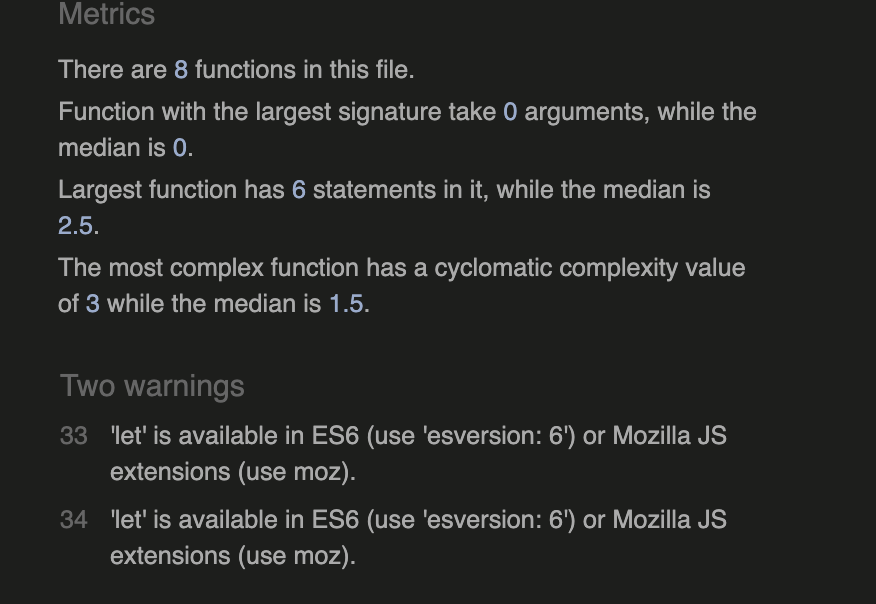

 - To test the python I put the app.py code through pep8 checker at http://pep8online.com/ which only flagged minor issues mainly with spacing between functions. Also put code throug another checker at https://www.pythonchecker.com/ which the code scored 100%.

 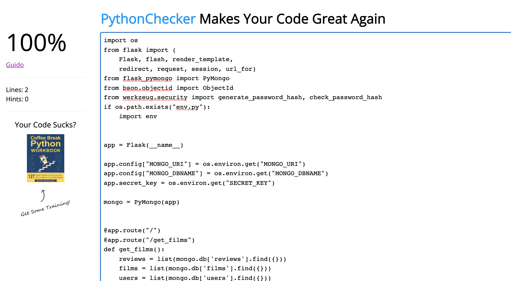

 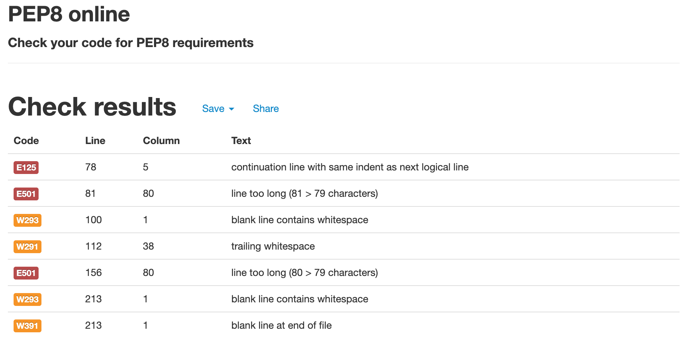

### Overall Test Conclusion

Based on all the testing I have performed on the website I feel the site functions well at a basic level achieving the project aims.

## Future changes/ add ons 

- Add users reviews to their own profile page so they can view all the reviews they have made.
- Add promo images for the films to make it more visuallly appealling.

#### Fix Issues

- Add media queries so the website functions properly on all size screens.

#### new features

### [Back to top](#contents)
